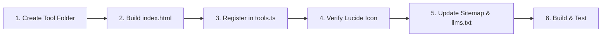

# ForgeKit Developer Guide: Creating & Registering New Tools

> A step-by-step technical standard for creating and integrating new 100% client-side tools into the **ForgeKit** platform and search engine.

---

## 1. Core Architecture Principles

Every tool added to ForgeKit must adhere to these non-negotiable architectural rules:

1. **100% Client-Side Execution**:
   - All computation, parsing, cryptography, file processing, and conversions must execute entirely inside the user's browser.
   - Zero external API dependencies, zero telemetry, zero analytics, zero server-side storage.
   - Leverage standard Web APIs: `Web Crypto API`, `Web Workers`, `HTML5 Canvas`, `IndexedDB`, `Blob`, `File API`, and `WebAssembly`.

2. **Dual Execution Model**:
   - **Embedded Mode (`/tools/:category/:slug`)**: Rendered seamlessly inside the ForgeKit platform with unified header, theme synchronization, fullscreen sandbox, quick switchers, and star favorites.
   - **Standalone Mode (`/:slug/index.html`)**: Direct, lightweight static HTML page accessible independently (e.g. `/json-formatter/index.html`).

---

## 2. Step-by-Step Workflow



---

## 3. Step 1: Create the Standalone Tool Directory

Create a new directory in the project root named after your tool's URL slug (kebab-case):

```bash
mkdir -p my-new-tool
touch my-new-tool/index.html
```

---

## 4. Step 2: Implement `my-new-tool/index.html`

Use the standard ForgeKit standalone template below. It includes:
- Tailwind CSS styling
- Instant 1-click Light/Dark theme listener
- Responsive container
- Error handling & toast/copy notifications

```html
<!DOCTYPE html>
<html lang="en">
<head>
  <meta charset="UTF-8" />
  <meta name="viewport" content="width=device-width, initial-scale=1.0" />
  <title>Tool Name — ForgeKit</title>
  <script src="https://cdn.tailwindcss.com"></script>
  <script>
    tailwind.config = {
      darkMode: 'class',
      theme: {
        extend: {
          colors: {
            paper: 'var(--color-bg, #ffffff)',
            surface: 'var(--color-surface, #f8fafc)',
            ink: 'var(--color-ink, #0f172a)',
            muted: 'var(--color-muted, #64748b)',
            line: 'var(--color-line, #e2e8f0)',
            accent: 'var(--color-accent, #3b82f6)',
          }
        }
      }
    }
  </script>
  <style>
    :root {
      --color-bg: #ffffff;
      --color-surface: #f8fafc;
      --color-ink: #0f172a;
      --color-muted: #64748b;
      --color-line: #e2e8f0;
      --color-accent: #3b82f6;
    }
    .dark {
      --color-bg: #090d16;
      --color-surface: #0f172a;
      --color-ink: #f8fafc;
      --color-muted: #94a3b8;
      --color-line: #1e293b;
      --color-accent: #60a5fa;
    }
    body { background-color: var(--color-bg); color: var(--color-ink); }
  </style>

  <!-- Theme Synchronization Script -->
  <script>
    (function () {
      function applyTheme(theme) {
        if (theme === 'dark') {
          document.documentElement.classList.add('dark');
        } else {
          document.documentElement.classList.remove('dark');
        }
      }

      // Check localStorage
      var saved = localStorage.getItem('toolbox:theme') || localStorage.getItem('theme-mode');
      var prefersDark = window.matchMedia('(prefers-color-scheme: dark)').matches;
      applyTheme(saved === 'dark' || (!saved && prefersDark) ? 'dark' : 'light');

      // Listen for parent postMessage when embedded in ForgeKit iframe
      window.addEventListener('message', function (event) {
        if (event.data && event.data.type === 'THEME_CHANGE') {
          applyTheme(event.data.theme);
        }
      });
    })();
  </script>
</head>
<body class="min-h-screen p-4 sm:p-6 font-sans">
  <div class="max-w-5xl mx-auto space-y-6">
    <!-- Tool Header -->
    <div class="flex items-center justify-between border-b pb-4" style="border-color: var(--color-line);">
      <div>
        <h1 class="text-xl sm:text-2xl font-bold">Tool Name</h1>
        <p class="text-xs sm:text-sm text-muted">1-2 sentence description of what the tool accomplishes.</p>
      </div>
      <div class="flex items-center gap-2">
        <button id="copy-btn" class="px-3 py-1.5 rounded-lg text-xs font-semibold bg-accent text-white hover:opacity-90 transition-opacity">
          Copy Output
        </button>
      </div>
    </div>

    <!-- Main Tool Interface -->
    <div class="grid grid-cols-1 md:grid-cols-2 gap-4">
      <!-- Input Panel -->
      <div class="flex flex-col space-y-2">
        <label class="text-xs font-bold uppercase tracking-wider text-muted">Input</label>
        <textarea
          id="input-text"
          class="w-full h-80 p-3 text-xs sm:text-sm font-mono rounded-xl border focus:outline-none focus:ring-2 focus:ring-accent"
          style="background-color: var(--color-surface); border-color: var(--color-line);"
          placeholder="Paste or type content here..."
        ></textarea>
      </div>

      <!-- Output Panel -->
      <div class="flex flex-col space-y-2">
        <label class="text-xs font-bold uppercase tracking-wider text-muted">Output</label>
        <textarea
          id="output-text"
          readonly
          class="w-full h-80 p-3 text-xs sm:text-sm font-mono rounded-xl border focus:outline-none"
          style="background-color: var(--color-surface); border-color: var(--color-line);"
          placeholder="Result will appear here..."
        ></textarea>
      </div>
    </div>
  </div>

  <script>
    // Tool Processing Logic
    const inputEl = document.getElementById('input-text');
    const outputEl = document.getElementById('output-text');
    const copyBtn = document.getElementById('copy-btn');

    function processInput() {
      try {
        const val = inputEl.value;
        // Perform 100% client-side transformation
        outputEl.value = val ? val.toUpperCase() : '';
      } catch (err) {
        outputEl.value = 'Error: ' + err.message;
      }
    }

    inputEl.addEventListener('input', processInput);

    copyBtn.addEventListener('click', () => {
      if (!outputEl.value) return;
      navigator.clipboard.writeText(outputEl.value);
      const original = copyBtn.innerText;
      copyBtn.innerText = 'Copied!';
      setTimeout(() => { copyBtn.innerText = original; }, 1500);
    });
  </script>
</body>
</html>
```

---

## 5. Step 3: Register Tool in ForgeKit Search Engine

Open [`src/data/tools.ts`](file:///home/sayandeep/workspace/sayandeepmajumdar.github.io/src/data/tools.ts) and add your tool definition to the `TOOLS` array:

```typescript
{
  id: 'my-new-tool',                          // Unique string ID
  name: 'My New Tool Name',                   // Display title
  slug: 'my-new-tool',                        // Exact directory name in root
  description: 'Concise, high-impact description indexed by search engine.',
  category: 'developer',                      // Primary category ID
  secondaryCategories: ['data', 'security'],  // Optional secondary categories
  icon: 'Wrench',                             // Lucide icon name
  tags: [                                     // Search keywords & aliases
    'my-tool',
    'converter',
    'parser',
    'formatter',
    'json',
    'devops'
  ],
  popular: true,                              // Show in Popular filter
  localProcessing: true,                       // Always true (100% client-side)
  badge: 'Dev & Utilities',                   // Visual pill badge
},
```

### Available Categories

| Category ID | Label | Description |
| :--- | :--- | :--- |
| `developer` | Developer | Formatters, parsers, validators, encoders, dev tools |
| `security` | Security & Privacy | Cryptography, hashing, RSA, AES, password generators, CSP |
| `design` | Design | Color pickers, CSS tools, Mermaid, BPMN, flowcharts |
| `images` | Images | SVG tools, image converters, EXIF metadata viewer |
| `data` | Data | CSV/JSON/XML converters, diff checkers, spreadsheet tools |
| `text` | Text | Markdown editors, Lorem Ipsum, text transformers |
| `business` | Business | Invoices, quotations, receipts, business cards |
| `finance` | Finance | Loan/EMI calculators, percentage & mortgage tools |
| `marketing` | Marketing & SEO | XML sitemap generators, robots.txt analyzers |
| `pdf-documents` | PDF & Documents | In-browser PDF converters and document exporters |
| `media` | Media | Audio, video, and multimedia utilities |
| `productivity` | Productivity | Notes, snippet managers, time converters |

---

## 6. Step 4: Verify Lucide Icon Support

Open [`src/components/common/DynamicIcon.tsx`](file:///home/sayandeep/workspace/sayandeepmajumdar.github.io/src/components/common/DynamicIcon.tsx).

If you chose a Lucide icon that is not yet mapped in `ICON_MAP`, import it and add it to the map:

```typescript
import {
  Wrench,
  Sparkles,
  MyNewIcon, // <-- Import from lucide-react
} from 'lucide-react';

const ICON_MAP: Record<string, React.ComponentType<any>> = {
  Wrench,
  Sparkles,
  MyNewIcon, // <-- Add to registry
};
```

---

## 7. Step 5: Update `sitemap.xml` & `llms.txt`

1. **[`sitemap.xml`](file:///home/sayandeep/workspace/sayandeepmajumdar.github.io/sitemap.xml)**:
   Add both the standalone tool and platform URLs:
   ```xml
   <url>
     <loc>https://sayandeepmajumdar.github.io/my-new-tool/</loc>
     <lastmod>2026-08-20</lastmod>
     <changefreq>monthly</changefreq>
     <priority>0.8</priority>
   </url>
   <url>
     <loc>https://sayandeepmajumdar.github.io/tools/developer/my-new-tool</loc>
     <lastmod>2026-08-20</lastmod>
     <changefreq>monthly</changefreq>
     <priority>0.8</priority>
   </url>
   ```

2. **[`llms.txt`](file:///home/sayandeep/workspace/sayandeepmajumdar.github.io/llms.txt)**:
   Add the tool under the corresponding category section:
   ```markdown
   - [My New Tool Name](https://sayandeepmajumdar.github.io/tools/developer/my-new-tool): Concise explanation of functionality.
   ```

---

## 8. Step 6: Build & Test Locally

Run the development server to verify the search engine indexes your new tool:

```bash
# Start local dev server
npm run dev
```

1. Open `http://localhost:3000/tools/`.
2. Type your tool name, slug, or tags into the **ForgeKit Search Bar**.
3. Verify that your tool appears in the search results, category pills, and tag filters.
4. Click on the tool card to test:
   - Embedded preview inside `/tools/developer/my-new-tool`.
   - Dark/Light mode switching.
   - "Standalone" button opens `http://localhost:3000/my-new-tool/index.html`.
   - "Open in New Window" popout.
   - Star favorite toggling.

---

## 9. Step 7: Build for Production

Compile production assets and verify zero errors:

```bash
# Type-check
npx tsc --noEmit

# Production build
npm run build
```

Commit and push to GitHub:

```bash
git add .
git commit -m "feat(tools): add My New Tool to ForgeKit"
git push origin main
```
